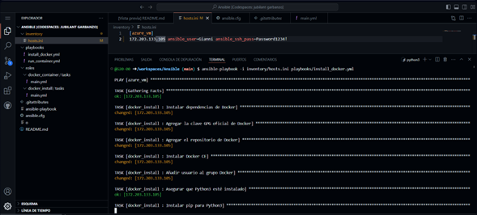
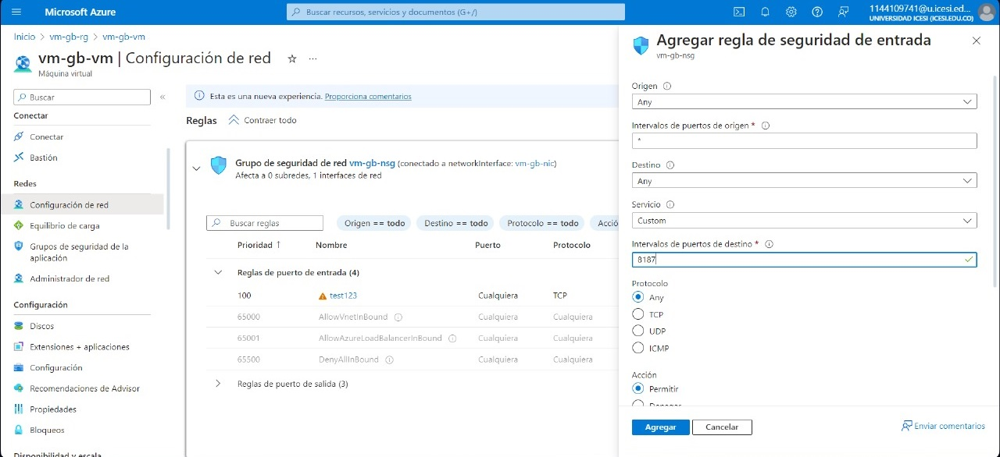
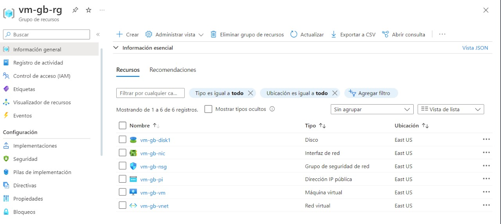
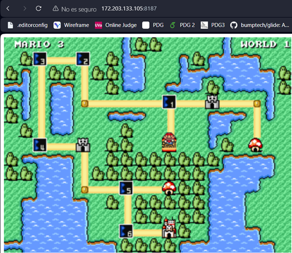

# Ansible Configuracion por Gianni
## **_Construido con_** 🛠️

<div style="text-align: left">
    <p>
        <a href="https://code.visualstudio.com" target="_blank"> 
            
        </a>
        <a href="https://www.ansible.com" target="_blank">
            
        </a>
    </p>
</div>


## **_Versionado_** 📌

<div style="text-align: left">
    <a href="https://github.com/" target="_blank"> </a>
</div>

## Descripción

Este proyecto Ansible automatiza la configuración de máquinas virtuales en Azure para instalar Docker y desplegar contenedores específicos. Utilizando Ansible, simplificamos el proceso de preparación de entornos y aseguramos que nuestras aplicaciones se ejecuten en un entorno controlado y replicable.

## Comenzando

### Requisitos Previos

Asegúrate de tener Ansible instalado. Las instrucciones de instalación para sistemas Debian/Ubuntu se incluyen a continuación. Para otros sistemas, consulta la documentación oficial de Ansible.

### Instalación de Ansible en Debian/Ubuntu

Sigue estos pasos para instalar Ansible, ejecutando los siguientes comandos en tu terminal:

```bash
# Actualiza tu lista de paquetes:
sudo apt update
# Instala el paquete necesario:
sudo apt install software-properties-common
# Añade el repositorio de Ansible:
sudo add-apt-repository --yes --update ppa:ansible/ansible
# Instala Ansible:
sudo apt install ansible
```

### Componentes del Proyecto

- **Inventory (`inventory/hosts.ini`)**: Define una máquina virtual en Azure con la dirección IP `23.96.121.29`, utilizando credenciales específicas para la conexión.

- **Playbooks**:
  - `install_docker.yml`: Este playbook se encarga de preparar el host definido en el inventory para instalar Docker, asegurando que todas las dependencias necesarias estén presentes y configurando el repositorio oficial de Docker para la instalación.
  - `run_container.yml`: Automatiza el despliegue de un contenedor Docker, específicamente un juego de Mario Bros, exponiendo el contenedor en el puerto `8187`.

- **Roles**:
  - `docker_install`: Contiene tareas para instalar Docker, incluyendo la instalación de dependencias, la adición de la clave GPG de Docker, la configuración del repositorio, la instalación de Docker CE, y la configuración necesaria para permitir la ejecución de Docker sin privilegios de superusuario.
  - `docker_container`: Define la tarea para desplegar el contenedor de Docker `supermario-container` usando la imagen `pengbai/docker-supermario:latest`, asegurando que el contenedor esté en estado iniciado y configurando el mapeo de puertos necesario.

### Configuración de Ansible (`ansible.cfg`)

Este archivo de configuración establece el path de los roles en `./roles`, especifica la ubicación del inventory en `./inventory/hosts.ini` y desactiva la verificación de la clave del host para facilitar las conexiones a hosts desconocidos.

## Ejecutando Playbooks de Ansible

Para desplegar configuraciones con Ansible utilizando los playbooks incluidos, usa los siguientes comandos:

- **Para instalar Docker** en los hosts definidos en tu inventario:
  
  ```bash
  ansible-playbook -i inventory/hosts.ini playbooks/install_docker.yml
  ```

- **Para ejecutar un contenedor Docker en tus servidores:
  ```bash
  ansible-playbook -i inventory/hosts.ini playbooks/run_container.yml
  ```
## Resultado Configuración
<p align="left">
  
</p>

## Configuración De Red Azure
<p align="left">
  
</p>

## Vista Maquina Virtual
<p 
  
</p>

## Juego Corriendo
<p 
  
</p>

## **_Autor_** ✒️

<div style="text-align: left">
    <a href="https://github.com/G20-00" target="_blank"> </a>
</div>
---
